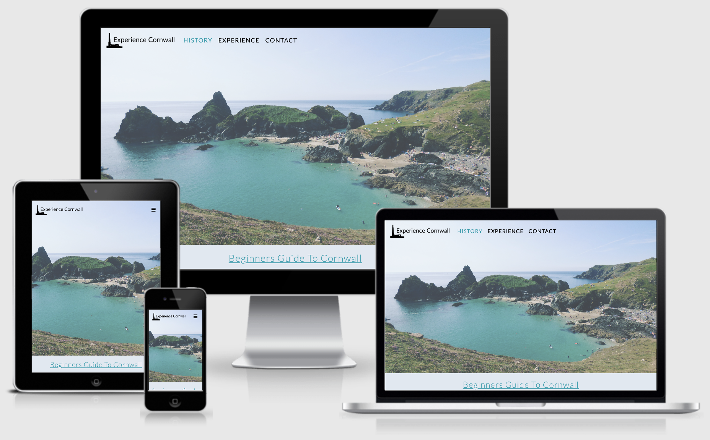

# Milestone Project 2 - Experience Cornwall
View live project <a href="https://gregory4321.github.io/milestone-project-2/">here
***
## Table of Contents:
* [What does it do and what does it need to fulfill?](#what-does-it-do-and-what-does-it-need-to-fulfill)
* [User Experience](#user-experience)
   * [User Stories](#user-stories)
   * [Design](#design)
       * [1. Colour Scheme](#1-color-scheme)
       * [2. Font](#2-font)
       * [3. Logo](#3-logo)
       * [4. Geometry](#4-geometry)
       * [5. Wireframes](#5-wireframes)
* [Technologies Used](#technologies-used)
* [Features](#features)
   * [Existing Features](#future-features)
   * [Future Features](#removed-features)
* [Testing](#testing)
* [Deployment](#deployment)
    * [Hosting on Github Pages](#hosting-on-github-pages)
    * [Running Project Locally](#running-project-locally)
* [Credits](#credits)
    * [Content](#content)
    * [Code](#code)
    * [Media](#media)
* [Acknowledgements](#acknowledgements)
* [Special Thanks](#special-thanks)
* [Disclaimer](#disclaimer)
***

## 

### Experience Cornwall Logo

***
## **What does it do and what does it need to fulfill?**
This is my second milestone project where I have designed, created and built a mobile-first, fully responsive and interactive website for 
experiencing the county of Cornwall, England. My goals with this website are to share the uniqueness of what Cornwall has to offer, inspiring
people to visit and learn about its history of Cornish mining, sea fishing, and culture and heritage. 

I have taken my knowledge learnt from the first five modules of the Full Stack Web Developer course, (HTML, CSS Fundamentals, User Centric Frontend 
Development, JavaScript Fundamentals and Interactive Frontend Development Modules) to provide a clear, functioning and responsive website that 
demonstrates a proficient use of HTML5, CSS3 and JavaScript. The Bootstrap Framework was used along side these programming languages to help give
the site a clear strucutre and ensure the site is as responsive as possible for use across various screen sizes, including desktop, tablet and
mobile. The jQuery framework was used amoungst my own JavaScript code for easier implementation of some code.

## **User Experience**

#### User Stories:
* User Goals:
    * As a user, I want to be able to navigate through the entire site, comfortably and securely.
    * As a user, I want to be able to easily contact the site with any initial queires that I may have, submit questions, and recieve an
    acknowledgement via email of my message being received, and a due response.
    * As a user, I want to learn more about the county of Cornwall and its history, and what can be seen and done there, where to eat and where to
    stay.
    * As a user, I want to be able follow links from the site to the site I am looking at, ie hotel or activity own's website.
    * As a user, I want 
    
* For the use, the site assists in meeting the user goals by:
    * Presenting a clean, easy on the eye website
    * 
  

[Back to Top](#table-of-contents)

#### Design
##### 1. Colour Scheme

I chose colors that would be soothing and calming on first glance of the website, and not intrusive. The muted tones give the page a serene look
and feel. This was important to me as my aim was to create an online space that promotes and represents a feeling of what colours can be found
throughout Cornwall, from the ranges of blue of the ocean, the rolling green countryside, and golden sand beaches.

Colours I used are:

* DFE8F1 - Alice Blue - Primary Colour
* F8E5D0 - Antique White - Secondary Colour
* 01A1B1 - Viridian Green - Accent Colour
* 61999E - Cadet Blue - Button Hover Colour
* 000000 - Black - Text Colour
* FFFFFF - White - Navbar on Scroll Colour

The primary colour, Alice Blue (DFE8F1), was used throughout the pages to give the whole site consistency. I used a coloured background after
receiving feedback from my Milestone 1 Project about having the majority of text on a white background. I found that it gives the page a nicer
overall feeling. 
I made the navbar transparent, until the user scrolls below a set amount of pixels, where the navbar would turn, White (FFFFFF), showing a clear
contrast between the navbar and the rest of the page. This allows the user to easily use the navbar for navigation around the site. 
The secondary colour, Antique White (F8E5D0), was used only in the footer to give a sense of the beaches and golden sand. This broke away well
from the rest of the page, making it clear to the user that they are at the bottom of the page. It also gave a nice contrast to the rest of the
colours used on the page, complimenting one another. 
Throughout the site, I used Viridian Green (01A1B1) s my accent colour. This colour was pulled from the ocean of the hero image used on my home
page. I used this colour for all headings, all buttons across the pages, the back to top button, the social links in the footer, and any active
text, ie the current page the user is on. I then took this colour and made it a slighlty darker shade, Cadet Blue (61999E), to be used when all of
the buttons were hovered over to give the user clarification when they are able to interact with a button. 
I opted for Black (00000) as my text colour to make sure all the words clear and easy to read. As stated above, the headers and the current active
page shown on the navbar where the accent colour.

##### 2. Font

I decided to use two fonts throught my site. I included these fonts by inserting an _import_ link of Google Fonts API into the top of my 
style.css. 
The font I chose for the body text on the pages was 'Raleway', with a fall back of 'Sans-serif' should the site not load the import correctly. I
found the 'Raleway' font was clear and easy to read and fed into the simple, minimal look, a feel I was trying to achieve with the site. 
The second font I used was 'Lato', again with the fallback of 'Sans-serif'. I used this for anything I wanted to stand out a little more, as i felt
it had a more structured, bold like format. This included the navbar, footer, headlines, sub-headings, buttons and forms. I used this font for all
of the form as I felt that with basic content it didn't need different fonts. Overall, I wanted a font that complemented the body text without
being wildly different from it. This would have made the page too busy and drawn attention away from the beautiful, peace-invoking imagery it was
sitting alongside. Simplicity was key and the combination of Raleway and Lato helped me achieve that objective.
When it came to font weight, between the two fonts, I varied between 300 and 500 for differnt factors across the pages. 400 took precendent as the
average font weight, and then card heads were given 500 to stand out clearer and more bold, for the page headings, the info window headings, and
the modal content looked best with using 300.

##### 3. Logo

The logo was created using an online design tool called Canva. I created a custom canvas to fit my required dimensions and set the background to
be transparent as I was using a transparent navbar. When it came to designing the logo I wanted a symbol that represented Cornwall, and decided
that an engine house is the embodiment of Cornish culture. I selected the engine house from google's selection of free images and played with the
contrast and saturation to get it black and white so it would stand out clearly with the transparent background, as well as matching the black font
of the logo "Experience Cornwall". I chose the font 'Lato' for this text to match the font used for headings throughout the site, keeping a clear
consistency. It suited the site's branding and complemented all my other design choices well. 

##### 4. Composition

There is a clear structure throughout the site. Each of the main pages has a hero image at the top to engage the user. I also implemented content
hinting on all the pages to encourage scrolling and more user interaction. 
To help me keep the design neat and consistent, I had all content displayed central, with good margins for desktop use to avoid anything being cut
off the screen. I ensured all content is full width for mobile sizes, utilising all of the space available. I found that having to scroll down the
home page made it feel like the story was unfolding which I thought was a nice touch. The google map on the expereince page has been set to full
width to keep the map easily readable across all screen sizes. I made use of the 'Rule of Thirds" in the 'Top 3 Recommendations' section to help
draw the viewer's eye into the composition, rather than just glancing at the center, so I wanted to make sure I implemented it in my design. 

##### 5. Wireframes

Wireframes for this project were created using Figma. I initially sketched rough ideas down on paper and then further constructed them on the 
computer using Figma to create a more detailed mockup. The final pages I ended up with on the website did not vary too much from the wireframes I
made during the planning stages. Find the links to these wireframes below:

* [Home Page Wireframe](https://github.com/Gregory4321/milestone-project-2/blob/master/assets/images/wire-home.png)

* [Activities Page Wireframe](https://github.com/Gregory4321/milestone-project-2/blob/master/assets/images/wire-activity.png)

* [Contact Page Wireframe](https://github.com/Gregory4321/milestone-project-2/blob/master/assets/images/wire-contact.png)

[Back to Top](#table-of-contents)

 ## **Technologies Used**

 #### Languages

 * [HTML5](https://en.wikipedia.org/wiki/HTML5) - Language used to create the structure of the pages.

 * [CSS3](https://en.wikipedia.org/wiki/Cascading_Style_Sheets) - Language used to add styling across all pages.

* [JavaScript](https://en.wikipedia.org/wiki/JavaScript) - Language used to create interactivity across the pages.

#### Libraries, Frameworks and Editors

* [Bootstrap 4.5.0](https://getbootstrap.com/) - used to creat basic HTML layout and structure and using Bootstrap's CSS Framwework. The
resposnsive grid system was utilised well.

* [Google Fonts](https://fonts.google.com/) - was used to import the 'Roboto' and 'Noto Sans' fonts, that were used across all pages.

* [Font Awesome](https://fontawesome.com/) - was used for the social icons and the calender link found in the footer.

* [jQuery](https://jquery.com/) - was used in conjunction with Bootstrap to create the navbar collapse element, opacity of the navbar on the scroll
of the page, and the modal pop up on submission of the contact form.

* [EmailJS](https://www.emailjs.com/) - was used to send an email from JavaScript.

* [Favicon](https://favicon.io/) - was used to generate the favivon image.

* [Git](https://git-scm.com/) - used for version control by making use of the Gitpod terminal to add, commit and push to Github.

* [Github](https://github.com) - used to host the project's repository and store the code, as well as host the website on Github pages.

* [Unsplash](https://unsplash.com/) - used to find images for use across the site.

* [Pexels](https://www.pexels.com/) - used to find images for use across the site.

* [Pixbay](https://pixabay.com/) - used to find images for use across the site.

* [Google Images](https://google.com) - used to find images for use across the site.

#### Tools

* [Google](https://www.google.co.uk/) - was used for researching various techniques, styles and information.

* [Google Chrome DevTools](https://developers.google.com/web/tools/chrome-devtools) - used for testing and debugging.

* [Google Maps](https://www.google.co.uk/maps) - used to embed a map to show the whereabouts of the gym.

* [Figma](https://www.figma.com/) - used for creating the wireframes in the design stage.

* [Coolors](https://coolors.co/) - used to find and compare colours that complimented one another.

* [Canva](https://www.canva.com/) - was used to design and create the logo, create the favicon logo, and also to resize images to specific dimensions.

* [Picresize](https://picresize.com/) - was also used to resize images for less specific wants, such as 25% or 50% smaller.

* [Am I Responsive](http://ami.responsivedesign.is/) - used for showing the responsiveness of the site across different screen sizes and providing
the image at the top of this document.

* [Free Online HTML Formatter](https://www.freeformatter.com/html-formatter.html#ad-output) - used to format the HTML code in a neater and more
organised fashion.

## **Features**

#### Existing Features

* Navbar - Featured across all pages, site visitors can use the links on the right to navigate between all pages on the website. These links also collapse down into a hamburger icon at smaller screen sizes. The logo, found on the left, can be clicked on all pages to take users back to the home page.

* Footer - Also featured across all pages, the footer is used for imforming the user that they can book a tour and provides a link in the form of an icon to the contact page where said tour can be scheduled. This is found on the left third of the footeer. On the right third of the footer, users will find social icons linking to the coresponding social media pages.

* Hero images -  These can be found across the three main pages (Home, Classes and About), and provide a visual reference to the page the user is on. There is also text displayed on top of the image, relating to the page, as well as a call to action button linking to desired pages - e.g.: Register page from the Home and About pages, and Contact page from the Classes page. These interavtive features encourage the user to register with the gym and book a class. There is also a hero image used on the homepage at the bottom to advertise that there will soon be a spa available at the gym. This is to ensure the user that the gym is still an expanding facility, forever moving forward.

* Testimonials - The 'Why Choose Us' section was created to showcase what other customers thought of the gym and what it has to offer.

* Classes Page - This page showcases what classes are available, informing the user what to expect from each class. It also contains a timetable that the user can use to decide what classes they can take on a particular day and time.

* About Page - This page was created to help the user understand how the gym came about. The gym promotes mental wellbeing and mindfulness which are incredibly personal facets of fitness. I wanted to appeal to readers by giving the gym a personal touch and providing the reader with an origin story that shows how the gym came about. 
I felt this added a personal touch and acknowledging the cultural origins of Soul Gym's practice gave the whole brand and platform more integrity.
I've also included a section which details Soul Gym's mission for the future. This is used to incentivise prospective members to sign up. It also enforces a sense of community for existing users and gives them a reason to revisit the site and check on the gym's projects progress 

* Contact Page - This page provides a form users can fill out to contact the gym. They can use this to book classes, schedul a tour and submit any other general enquiries. The user can also find the contact details of the gym below with an interactive map that can be clicked on and viewed on a larger scale on Google Maps in a seperate tab.

* Forms - Forms were used on the 'Login' and 'Register' pages. The user is invited to sign up to the gym by filling out the form or, alternatively, to sign into their existing account.

* 'Join Now' button on Registration Form - Once the user has completed the registration form and clicks 'Join Now', they are redirected to an internal page providing them with feedback that the registration has gone through successfully. It is important to provide feedback to the user so they feel their actions have been validated.

#### Future Features

* Gallery Page - A seperate page to showcase images of the gym's classes and interactions with their customers. This would give the user a more concrete idea of how the gym operates through using friendly and fun images.

* Donate Page / Modal - As described in the story on the about page, the gym donates 20% of its earnings to help towards community projects across Asia. A page where members and/or non-members can help contribute towards these initiatives will boost engagement with the gym and help the gym achieve its charitable goals.

* A more defined view of membership costs by perhaps creating a membership page containg the different packages on offer.

* Create a profile builder where the user fills in some questions, and then are show suggested profiles for them personally, highlighting timeslots that would work for them.

[Back to Top](#table-of-contents)

## **Testing**

Testing can be found via this [link](https://github.com/Gregory4321/milestone-project-1/blob/master/testing.md)

## **Deployment**

This multi-page website was developed in Gitpod and pushed to the remote repository on Github.

#### Hosting on Github Pages

The project was deployed through Github pages. This was achieved by following these steps:

* Login in to Github and locate and click the Github repository on the left side of the screen.
* At the top of the repository, locate and select the 'Settings' button.
* Scroll down to the 'Github Pages' section.
* Use the drop-down menu under 'Source' to change from 'none' and select 'master branch'.
* The page then automatically refreshes and takes the user back to the top of the page.
* Scroll back down to the 'Github Pages' section. A ribbon notification is now displayed containing the link to the deployed site.
* The ribbon notification displays this message:  'Your site is published at https://gregory4321.github.io/milestone-project-2/'
* I have provided this link at the top of the README file.

#### Running Project Locally 

To run your own version of this project, it can be cloned or downloaded from Github by following these steps:

* Select the repository from the Github dashboard.
* Click on the green 'Code' button, and click the 'clipboard icon' to copy the URL. It may also be displayed as a 'Clone or Download' green button.
* Open the terminal window of your desired local IDE (Integrated Development Environment).
* Choose the working directory to the location you would like to have the cloned repository.
* Type 'git clone' in the terminal window, and then paste the URL you copied.
* Press enter and the clone will be created.

## **Credits**

#### Content

All content on the website was written by me, the developer, with inspiration taken from other travel and informational sites. 

#### Code

* The code throughout the project used [Bootstrap4](https://getbootstrap.com/docs/4.4/getting-started/introduction/) as its base to create a responsive site, utilising the Bootstrap grid system.

* Inspiration on how to place and style the hero images was taken from Stack Overflow posts.

* All other code was written by me, the developer.

#### Media

The images used on the website were taken from two different image libraries:

* [Unsplash](https://unsplash.com/)

* [Pexels](https://www.pexels.com/)

* [Pixbay](https://pixabay.com/) 

These images were then resized to suit the wants of me, the developer, using these two sites:

* [Canva](https://www.canva.com/)

* [Picresize](https://picresize.com/)

The logo image was created and exported to my computer using the site [Canva](https://www.canva.com/)

## **Acknowledgements**

#### Pages used for inspiration

* [More Yoga](https://www.moreyoga.co.uk/)

* [Gym Box](https://www.gymbox.com/)

* [Hot House Yoga](https://hothouseyogi.com/)

#### Pages used for information

* [Stack overflow](https://stackoverflow.com/)

* [W3schools](https://www.w3schools.com/)

* [CSS-Tricks](https://css-tricks.com/)

* [Code Institute](https://codeinstitute.net/)

* [Code Institute Sample README](https://github.com/Code-Institute-Solutions/SampleREADME)

* [Slack](https://slack.com/intl/en-gb/)

* [YouTube](https://www.youtube.com/watch?v=qmPmwdshCMw)

* [Code Pen](https://codepen.io/)

* [Markdown Cheatsheet](https://github.com/adam-p/markdown-here/wiki/Markdown-Cheatsheet)

#### Special thanks

* Seun Owonikoko @seun_mentor, my mentor, for the support and guidance she gave thoughout the build of this project.

* Tutor Support at Code Institute for accepting my request for more time and giving me the initial push that really got me going. Xavier from tutor support, your advice and guidance helped me more than I think you know. 

* Anthony 0'Brien from the Slack Community for supporting me along the way by answering my stupid-questions and giving me guidance on solving any problems I had with the forms and the 'Submit' button.

* Code Institute for the informative lessons and teachings they provided.

[Back to Top](#table-of-contents)

## Disclaimer

This project was created for educational use only. It has been part of studying at the Code Institute as part of their Full Stack Web Developer Course.